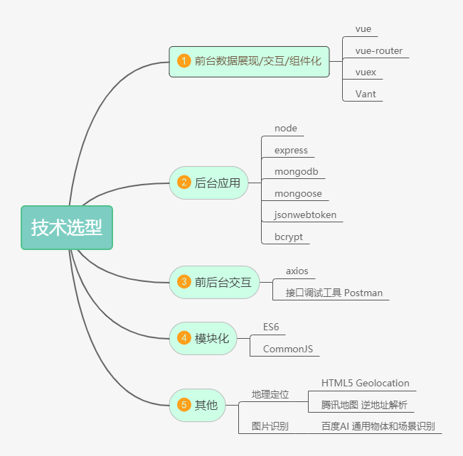

# 开发模式

> 模块化，组件化，工程化

# 技术选型




# api列表

 + 登录接口: http://localhost:2728/api/user/login   (POST)

 + 注册接口: http://localhost:2728/api/user/register  (POST)

 + 更新用户信息接口 : http://localhost:2728/api/user/updateInfo/:id (POST)

 + 更换头像接口 : http://localhost:2728/api/user/updateAvatar/:id  (POST)

 + 更新积分接口 : http://localhost:2728/api/user/{积分种类}/:id   (POST)
 
 + 获取单个用户信息接口 :  http://localhost:2728/api/user/userInfo/:id (GET)

 + 获取所有用户信息，并以总分降序排序 : http://localhost:2728/api/user/allUser (GET)


 + 提交评分接口 : http://localhost:2728/api/rate/submit   (POST)

 + 判断是否评分接口: http://localhost:2728/api/rate/isRate/:id  (GET)


 + 获取所有问题接口 : http://localhost:2728/api/exam/question  (GET)

 + 存储错题记录 : http://localhost:2728/api/exam/saveErrQues   (POST)

 + 获取单个用户错题记录接口 : http://localhost:2728/api/exam/errQues/:id (GET)

 + 删除单个用户错题记录接口 : http://localhost:2728/api/exam/deleteErrQues/:id (Post)

 
 + 定位接口 : http://localhost:2728/api/location/?lat=  & lng=    (GET)


 + 图像识别接口 : http://localhost:2728/api/recognize  (POST)


 + 垃圾分类接口 : https://quark.sm.cn/api/quark_sug?q=电脑是什么垃圾


# 技术支持

1. 图片识别使用百度ai识别，文档地址 https://ai.baidu.com/docs#/ImageClassify-Node-SDK/top

2. 地理定位使用腾讯地图逆地址解析api，文档地址 https://lbs.qq.com/webservice_v1/guide-gcoder.html

    + 请求示例 : http://localhost:2728/api/location?lat=31.32&lng=120.62

3. 经纬度获取采用html5集成的方法实现

    ```
    function getLocation(){
        if (navigator.geolocation){
            navigator.geolocation.getCurrentPosition(showPosition);
        }else{
            alert("Geolocation is not supported by this browser.");
        }
    }
    function showPosition(position){
        console.log("Latitude: " + position.coords.latitude)
        concole.log("Longitude: " + position.coords.longitude);   
    }
    ```
